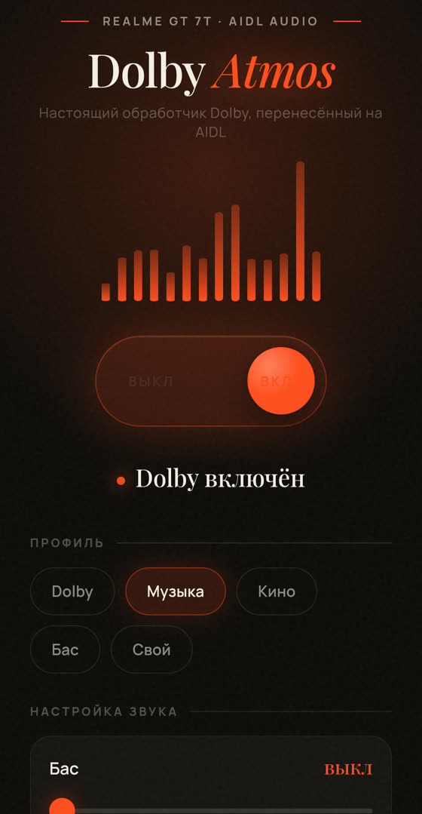
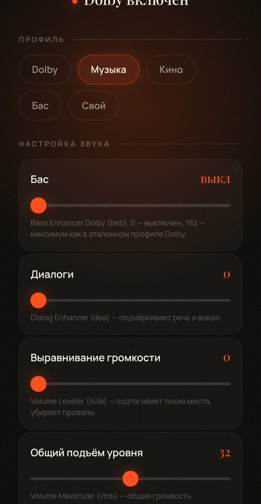
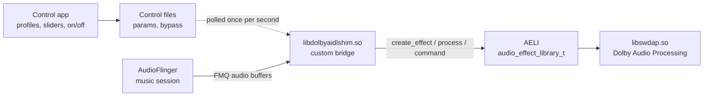

<div align="center">

# Dolby Atmos on an AIDL audio stack (Android 16)

**A bridge between Dolby's legacy effect interface and the modern Android audio HAL**


[Русская версия](README.md) · **English**




</div>

## Summary

A real **Dolby Atmos processing engine** is running on a Realme GT 7T (RMX5085, Android 16, MediaTek
Dimensity 9400e): the very DSP engine found on licensed Atmos devices, with intelligent EQ, volume
leveler, virtualizer and a live control app.

Every existing public Dolby port requires the **legacy (HIDL) audio stack**. New devices moved to
**AIDL**, while Dolby libraries only speak the old interface (`AELI`), so they are simply never loaded.
No AIDL build of the Dolby libraries exists.

This repository contains a **custom bridge**: it registers itself as a regular AIDL audio effect and
talks to Dolby through its native interface. On top of that, the Dolby parameter protocol was reverse
engineered so the effect does not just load, but actually processes audio.

## The problem

| | Legacy devices (Android 13 and older) | This device (Android 16) |
|---|---|---|
| Audio stack | HIDL / legacy | AIDL (audio effect HAL V2) |
| What the loader looks for | symbol `AELI` | `createEffect`, `queryEffect`, `destroyEffect` |
| Dolby libraries export | `AELI` | `AELI` |
| Result | existing ports work | **none of the public ports work** |

## Architecture



Audio is exchanged through shared memory queues (FMQ): the framework writes a buffer, the bridge
processes it with the Dolby engine and writes the result back. Parameters are delivered over a
separate command channel.

## What is implemented

- **AELI to AIDL bridge.** The library exports `createEffect` / `queryEffect` / `destroyEffect` in the
  AIDL V2 format and proxies calls into Dolby's `AELI` structure. Around 1000 lines of C++17 built with
  the NDK, linked against LLNDK only.
- **Custom synchronization.** The system `EventFlag` from `libfmq` cannot be used inside the HAL process
  because of an ABI conflict (`std::__1` versus `std::__ndk1`), so the queue protocol is implemented
  directly with Linux futexes (`FUTEX_WAIT_BITSET` / `FUTEX_WAKE_BITSET`).
- **Reverse engineered parameter protocol.** Dolby is controlled by four character codes (`deon`,
  `ieon`, `dvle`, `beb` and others) inside a fixed binary blob. Codes and layout were recovered by
  disassembling the proprietary libraries, because Dolby's own parameter service (`DMS`) does not run
  on an AIDL stack.
- **Live control app.** A WebView based app with an on/off switch, profiles (Dolby / Music / Movie /
  Bass / Custom), sliders (bass, dialogue, volume leveler, overall boost, intelligent EQ), effect
  toggles and a processing log viewer. Changes apply instantly.
- **No firmware modification.** Everything lives in memory (bind mounts and patched configs). A reboot
  returns the device to its original state.
- **Diagnostics tooling.** Load probes for the libraries, mount checks, signal comparison before and
  after processing.

## Key findings

1. **Dolby libraries cannot do AIDL at all.** Three independent builds of `libswdap.so` (Sony, Poco F4,
   Nothing) were checked: none exports `createEffect`, all export only `AELI`.
2. **The real effect UUID comes from the library itself** (`kDescriptor`), not from the UUID used in
   public mods: with the public one, effect creation fails with `ENOENT`.
3. **Command order matters.** Without `EFFECT_CMD_INIT` the engine crashes on the first buffer, and
   `SET_DEVICE` sent too early crashes immediately.
4. **Dolby's buffer structure differs from the system one** (`audio_buffer_s`): frame count comes first,
   the data pointer second. With the system layout the engine reads garbage and crashes.
5. **Parameters are committed only when the "device" field is non zero.** Otherwise the engine accepts
   every parameter, answers "success" and changes nothing, which results in a silent, passthrough
   effect.
6. **Dolby processes audio in place, inside the input buffer.** A naive "input versus output" check
   always reports zero difference; a snapshot taken before processing is required.
7. **Sample format and channel masks are Dolby specific**: `PCM_FLOAT` is 5 (not 4 as some headers
   suggest) and channels are given as an index mask (`0x3` for stereo).

Details with function names, structure layouts and disassembly excerpts are in
[docs/TECHNICAL.md](docs/TECHNICAL.md). The parameter table is in [docs/PARAMS.md](docs/PARAMS.md).

## Tech stack

| Area | Used |
|---|---|
| Core | C++17, Android NDK r30 (clang, arm64), LLNDK (`libbinder_ndk`, `liblog`, `libcutils`) |
| System interfaces | AIDL effect HAL V2, `AidlMessageQueue`, Linux futexes, `dlopen` / `dlsym` |
| Environment | AOSP headers and AIDL generator, hand assembled header trees, minimal stubs |
| Reverse engineering | IDA Pro (decompilation of Dolby libraries), parameter table extraction |
| App | Java (WebView and JS bridge), HTML/CSS/JS, `aapt2`, `d8`, `apksigner`, `zipalign` |
| Scripts | Bash (on device deployment), Python (ELF patching, packaging), PowerShell (PC installer) |
| Debugging | `adb`, `logcat`, own file log, RMS and per sample signal comparison |

## Verified results on the device

- The effect is visible to the system: `EffectsFactoryHalAidl with 21 nonProxyEffects` (20 stock).
- Engine creation succeeds: `create_effect -> 0`, then `SET_CONFIG -> 0`, `EFFECT_CMD_INIT -> 0`.
- Parameters are accepted: `SET_VALUES: 32 params, 592 bytes, device=0x2 -> r=0 status=0`.
- Processing confirmed by measurement: the whole buffer changes (`diff=4096/4096`), leveler gain from
  +2 to +19 dB depending on program material.
- The app switch is a true A/B: off means transparent passthrough and quieter output, on means the full
  Dolby profile.

## Repository layout

```
shim/     bridge source, the core of the project
build/    bridge build script and library load probes
deploy/   on device deployment scripts and config patch notes
app/      Android app sources (Java and WebView UI)
docs/     technical notes, parameter table, build instructions
tools/    helper utilities (ELF dependency patching)
```

## How to reproduce

1. Build the environment and the bridge: [docs/BUILD.md](docs/BUILD.md).
2. Copy Dolby libraries (taken from a firmware that ships Atmos) and the `deploy/` scripts to the device.
3. Run `deploy/go.sh` as root: it mounts the library directories, registers the effect in the audio
   effect configs and restarts the audio services.
4. Install the app from `app/` and control the sound from it.

## Honest limitations

- **Proprietary Dolby libraries are not included and not distributed** here: they belong to Dolby
  Laboratories. Only original code is published.
- Requires an **AIDL audio stack (arm64)**.
- Changes live until reboot: nothing is written into system partitions.
- Dolby's own parameter service (`DMS`) does not run on this stack, so parameters are sent straight to
  the engine without vendor profiles.
- Tested on a single device (Realme GT 7T), but the approach transfers to any AIDL audio device with
  arm64 Dolby libraries.

## Author

**Nixbones**

The project was built as a hands on study in reverse engineering and systems programming: analyzing
closed source libraries, writing a system component in C++ and building a control interface.

## License

Project code is MIT (see [LICENSE](LICENSE)). Dolby libraries are not part of this repository and are
not covered by the license, see [NOTICE.md](NOTICE.md) for details. UI fonts (Manrope, Playfair Display)
are licensed under SIL OFL 1.1.
