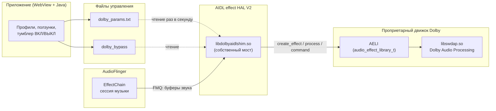

<div align="center">

# Dolby Atmos на AIDL-аудио Android 16

**Мост между закрытым интерфейсом Dolby и новым аудио-стеком Android**


**Русский** · [English version](README.en.md)


</div>

## Коротко

На телефоне Realme GT 7T (RMX5085, Android 16, MediaTek Dimensity 9400e) запущен **настоящий обработчик
Dolby Atmos**: тот самый DSP-движок Dolby, который стоит в прошивках с лицензией Atmos, с рабочим
эквалайзером, выравниванием громкости, виртуализацией и живым управлением из собственного приложения.

Проблема в том, что все существующие Dolby-моды требуют **старого (HIDL) аудио-стека**. На новых
устройствах аудио перешло на **AIDL**, а библиотеки Dolby умеют общаться только со старым
интерфейсом (`AELI`), поэтому на AIDL-устройствах они просто не загружаются. Готовой AIDL-версии
библиотек Dolby не существует.

Решение: **собственный мост**, который регистрируется в системе как обычный AIDL-эффект и внутри
себя работает с Dolby через её родной интерфейс. Плюс разобран протокол параметров Dolby, чтобы
эффект не просто загружался, а реально обрабатывал звук.

## Задача

| | Старые устройства (Android 13 и ниже) | Наше устройство (Android 16) |
|---|---|---|
| Аудио-стек | HIDL / legacy | AIDL (audio effect HAL V2) |
| Что ищет загрузчик | символ `AELI` в библиотеке | функции `createEffect`, `queryEffect`, `destroyEffect` |
| Библиотеки Dolby | экспортируют `AELI` | экспортируют `AELI` |
| Результат | моды работают | **не работают ни один из публичных модов** |

То есть разрыв именно в точке стыковки: система ждёт один контракт, библиотека умеет только другой.

## Архитектура



Аудио идёт через общую память (FMQ): система кладёт буфер, мост обрабатывает его движком Dolby и
возвращает результат, а параметры Dolby задаются отдельным каналом команд.

## Что реализовано

- **Мост `AELI` → AIDL.** Библиотека экспортирует `createEffect` / `queryEffect` / `destroyEffect` в
  формате AIDL V2 и внутри проксирует вызовы в структуру `AELI` библиотеки Dolby. Это ключевая часть,
  ради которой всё и делалось: ~1000 строк C++17 под NDK, линковка только с LLNDK.
- **Свой механизм синхронизации.** Системный `EventFlag` из `libfmq` не загружается в процессе HAL
  из-за конфликта ABI (`std::__1` против `std::__ndk1`), поэтому протокол очередей реализован
  напрямую через фьютексы (`FUTEX_WAIT_BITSET` / `FUTEX_WAKE_BITSET`).
- **Реверс протокола параметров Dolby.** Управление звуком у Dolby идёт по кодам из четырёх символов
  (`deon`, `ieon`, `dvle`, `beb` и другие), внутри блоба фиксированного формата. Коды и формат
  восстановлены дизассемблированием закрытых библиотек, поскольку штатный сервис параметров Dolby
  (`DMS`) на AIDL-устройстве не запускается.
- **Живое управление из приложения.** Своё приложение на WebView: тумблер, профили
  (Dolby / Музыка / Кино / Бас / Свой), ползунки (бас, диалоги, выравнивание громкости, общий подъём,
  умный эквалайзер), тумблеры эффектов, просмотр лога обработки. Изменения применяются на лету.
- **Развёртывание без пересборки прошивки.** Все изменения живут в оперативной памяти: bind-монтирование
  каталогов и конфигов, никаких правок разделов. Перезагрузка возвращает телефон в исходное состояние.
- **Инструменты диагностики.** Пробники загрузки библиотек, проверка узлов монтирования, реверс-скрипты,
  сравнение сигнала до и после обработки.

## Ключевые технические находки

1. **Библиотеки Dolby не умеют AIDL в принципе.** Проверены три независимые сборки `libswdap.so`
   (Sony, Poco F4, Nothing): ни в одной нет `createEffect`, все экспортируют только `AELI`.
2. **Настоящий UUID эффекта берётся из самой библиотеки** (`kDescriptor`), а не из публичных
   конфигов модов: с "общеизвестным" UUID создание эффекта возвращает ошибку `ENOENT`.
3. **Порядок команд критичен.** Без `EFFECT_CMD_INIT` движок падает в первом же буфере, а
   `SET_DEVICE` до инициализации конфигурации вызывает падение сразу.
4. **Формат буфера Dolby отличается от системного** (`audio_buffer_s`): счётчик кадров идёт первым
   полем, указатель на данные - вторым. При системном порядке движок читает мусор и падает.
5. **Параметры Dolby применяются только при ненулевом "устройстве" в посылке.** Иначе движок
   принимает все параметры, отвечает "успех" и не меняет ничего - именно эта деталь давала
   эффект-пустышку: звук проходил насквозь, хотя формально всё работало.
6. **Dolby обрабатывает звук прямо во входном буфере.** Из-за этого наивная проверка "вход против
   выхода" всегда показывает нулевую разницу; корректный замер требует снимка до обработки.
7. **Порядок каналов задаётся индексной маской**, а формат сэмплов у Dolby нумеруется иначе, чем в
   заголовках AOSP (`PCM_FLOAT` = 5, а не 4).

Подробный разбор каждой находки, с именами функций и форматами структур, лежит в
[docs/TECHNICAL.md](docs/TECHNICAL.md). Таблица найденных параметров Dolby - в [docs/PARAMS.md](docs/PARAMS.md).

## Технологии

| Область | Чем работал |
|---|---|
| Ядро решения | C++17, Android NDK r30 (clang, arm64), LLNDK (`libbinder_ndk`, `liblog`, `libcutils`) |
| Системные интерфейсы | AIDL effect HAL V2, `AidlMessageQueue`, фьютексы Linux, `dlopen`/`dlsym` |
| Сборка окружения | AOSP-заголовки и генератор AIDL (`aidl.exe`), сборка биндингов под NDK, стабы для системных заголовков |
| Реверс | IDA Pro (декомпиляция и дизассемблирование библиотек Dolby), чтение таблиц параметров, разбор протоколов по коду |
| Приложение | Java (WebView + JS-мост), HTML/CSS/JS, `aapt2`, `d8`, `apksigner`, `zipalign` |
| Скрипты | Bash (развёртывание на устройстве), Python (обработка ELF, сборка артефактов), PowerShell (установка с ПК) |
| Отладка | `adb`, `logcat`, собственный файловый лог, замеры RMS и по-сэмплового различия сигнала |

## Результаты на живом устройстве

- Эффект виден системе: `EffectsFactoryHalAidl with 21 nonProxyEffects` (было 20 системных).
- Создание движка Dolby: `create_effect -> 0`, затем `SET_CONFIG -> 0`, `EFFECT_CMD_INIT -> 0`.
- Параметры принимаются: `SET_VALUES: 32 параметра, 592 байта, устройство=0x2 -> r=0 status=0`.
- Обработка подтверждена измерением сигнала: изменяется **весь буфер** (`diff=4096/4096`), усиление
  выравнивателя от +2 до +19 дБ в зависимости от уровня записи.
- Переключатель в приложении проверен как честный A/B: в положении "выключено" обработка прозрачная
  и звук тише, в положении "включено" работает полный профиль Dolby.

## Структура репозитория

```
shim/     исходник моста AELI -> AIDL (ядро проекта)
build/    сборка моста + пробники загрузки библиотек
deploy/   скрипты развёртывания на устройстве, примеры конфигов
app/      исходники Android-приложения (Java + WebView-интерфейс)
docs/     техническая документация, таблица параметров, инструкция по сборке
tools/    вспомогательные утилиты (правка зависимостей ELF)
```

## Готовые сборки

Собранная библиотека моста и APK приложения лежат в разделе
[Releases](https://github.com/Nixbones/dolby-aidl-bridge/releases). Сборка не содержит библиотек
Dolby: их нужно взять из прошивки устройства, где Atmos присутствует (см. [docs/BUILD.md](docs/BUILD.md)).

## Как повторить

1. Собрать окружение и мост: [docs/BUILD.md](docs/BUILD.md).
2. Скопировать на устройство библиотеки Dolby (их нужно взять из прошивки устройства, где Atmos уже
   есть) и скрипты из `deploy/`.
3. Запустить `deploy/go.sh` от root: он примонтирует каталоги, зарегистрирует эффект в конфигах и
   перезапустит аудио-сервисы.
4. Установить приложение из `app/` и управлять звуком из него.

## Ограничения, о которых честно

- **Проприетарные библиотеки Dolby в репозиторий не входят** и не распространяются: они принадлежат
  Dolby Laboratories. Репозиторий содержит только собственный код. Библиотеки нужно взять из
  прошивки устройства, где Atmos присутствует.
- Решение рассчитано на устройства с **AIDL-аудио и архитектурой arm64**.
- Изменения живут до перезагрузки: постоянных правок в системе нет (это осознанный выбор, плюс на
  тестовом устройстве root сам по себе временный).
- Штатный сервис параметров Dolby (`DMS`) не запускается на этом аудио-стеке, поэтому параметры
  передаются напрямую движку, без профилей производителя.
- Проверено на одном устройстве (Realme GT 7T), но подход переносим: ему нужны только AIDL-аудио и
  библиотеки Dolby под arm64.

## Что можно развивать дальше

- автоматический запуск после получения root (механизм late-load), чтобы обходиться без ПК;
- графический эквалайзер в приложении (движок Dolby поддерживает полосы, формат уже разобран);
- подключение остальных эффектов из того же набора Dolby (голосовой, выравниватель громкости);
- упаковка в модуль для менеджера root-доступа.

## Автор

**Nixbones**

Проект сделан как практическая работа по обратной разработке и системному программированию:
разбор закрытых библиотек, написание системного компонента на C++ и собственного интерфейса управления.

## Лицензия

Код проекта - MIT (см. [LICENSE](LICENSE)). Библиотеки Dolby в репозиторий не входят и лицензией не
покрываются, подробности в [NOTICE.md](NOTICE.md). Шрифты интерфейса (Manrope, Playfair Display)
распространяются под SIL OFL 1.1.
